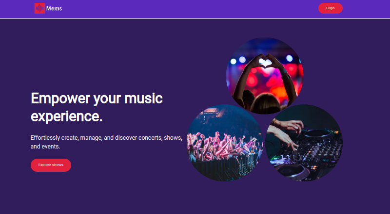
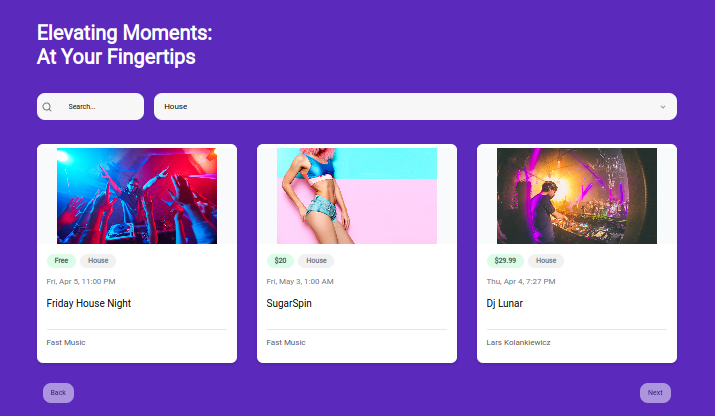

# Mems: Music Event Management System

Mems is a full-stack music event management system built with Next.js 14.




## Features

* Authentication
* CRUD (Create, Read, Update, Delete) event management
* Search and filtering
* Event categories
* Checkout and payments (using Stripe)


**Discover and filter through different music events**
 
## Tech Stack

- [Next.js 14](https://nextjs.org/)
- [Tailwind CSS](https://tailwindcss.com/)
- [React Hook Form](https://react-hook-form.com/)
- [Clerk](https://clerk.dev/)
- [Stripe](https://stripe.com/)

## Getting Started

To get started with Mems, follow these steps:

1. Clone the repository:

   ```bash
   git clone https://github.com/your-username/Mems-Music-Event-Mangement-System.git
   cd Mems-Music-Event-Mangement-System
   ```
